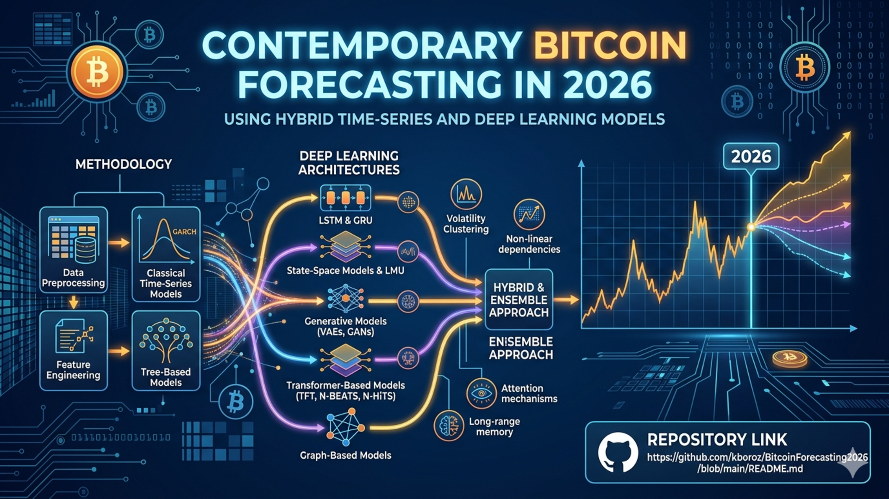

# Contemporary Bitcoin Forecasting in 2026

## Repository Link

[https://github.com/kboroz/BitcoinForecasting2026/edit/main/README.md]

## Description
Contemporary Bitcoin Forecasting Using Hybrid Time-Series and Deep Learning Models (2026)
Overview

Forecasting Bitcoin prices remains a challenging task due to high volatility, regime shifts, and sensitivity to macroeconomic and behavioral factors. This project proposes a comprehensive, multi-model framework that integrates classical statistical methods, machine learning, and modern deep learning architectures to improve predictive performance and robustness in 2026 market conditions.

Objectives
Develop and compare a diverse set of forecasting models for Bitcoin price prediction
Capture both linear and non-linear temporal dependencies
Evaluate model performance using robust regression loss functions
Explore hybrid and ensemble approaches for improved accuracy
Methodology

1. Data Preprocessing

Clean and normalize historical Bitcoin price data and auxiliary signals (volume, macro indicators, sentiment proxies)
Handle missing values, outliers, and structural breaks
Apply transformations (log returns, differencing) to ensure stationarity
Define evaluation metrics and loss functions (e.g., MSE, MAE, Huber loss)

2. Classical Time-Series Models

Implement ARIMA/SARIMAX for baseline forecasting
Model volatility clustering using GARCH-family models
Establish interpretable benchmarks for comparison

3. Feature Engineering

Extract lag-based features, rolling statistics, and technical indicators
Incorporate calendar effects and market microstructure variables
Prepare structured inputs for machine learning models

4. Tree-Based Models

Train models such as Random Forests and Gradient Boosting
Capture non-linear relationships and interaction effects
Evaluate feature importance for interpretability

5. Recurrent Neural Networks

Apply LSTM and GRU architectures for sequential modeling
Capture long-term dependencies and temporal dynamics
Tune sequence length and hidden representations

6. State-Space Models & LMU

Use state-space formulations for probabilistic forecasting
Explore Legendre Memory Units (LMU) for efficient long-range memory

7. Dependence Modeling

Analyze cross-feature dependencies and temporal correlations
Potentially incorporate copula-based approaches

8. Generative Models

Use VAEs and GANs for scenario generation and data augmentation
Enhance robustness under sparse or extreme market conditions

9. Transformer-Based Models

Implement Transformers and Temporal Fusion Transformers (TFT)
Model long-range dependencies and multi-horizon forecasts
Integrate attention mechanisms for interpretability

10. Advanced Forecasting Architectures

Apply N-BEATS, N-HiTS, and extended LSTM variants
Benchmark against prior deep learning approaches

11. Graph-Based Models

Model relationships between assets, exchanges, or market signals
Use graph neural networks to capture structural dependencies

12. Time-Series Foundation Models

Explore emerging Time-Series LLMs for zero-shot or few-shot forecasting
Compare against specialized architectures

### Task Type

[Image Classification / Chatbot / Regression / Clustering / Other]

### Results Summary

#### Best Model Performance
- **Best Model:** [Name and type of the best-performing model"]
- **Evaluation Metric:** [Primary metric used, e.g., Accuracy, F1-Score, MSE, MAE]
- **Final Performance:** [Best score achieved, e.g., 95% accuracy, F1-score of 0.87, MSE of 0.12]

- Evaluation Strategy
Use rolling-window backtesting
Evaluate with MSE, MAE, RMSE, and directional accuracy
Compare robustness across different market regimes (bull, bear, sideways)
Expected Outcomes

#### Model Comparison
- **Baseline Performance:** [Baseline model performance for comparison]
- **Improvement Over Baseline:** [Quantitative improvement, e.g., "+12% accuracy", "25% reduction in MSE"]
- **Best Alternative Model:** [Second-best model and its performance]

  Identification of best-performing models for Bitcoin forecasting in 2026

#### Key Insights
- **Most Important Features:** [Top 3-5 features that drive model performance]
- **Model Strengths:** [What the model does well]
- **Model Limitations:** [Known limitations and failure cases]
- **Business Impact:** [Practical implications of the model performance]

Insights into trade-offs between interpretability and predictive power
A scalable forecasting pipeline adaptable to other crypto assets

Conclusion

  By combining traditional econometric models with modern deep learning and foundation models, this project aims to provide a state-of-the-art framework for Bitcoin forecasting that reflects the complexity of contemporary financial markets.

## Documentation

1. **[Literature Review](0_LiteratureReview/README.md)**
2. **[Dataset Characteristics](1_DatasetCharacteristics/exploratory_data_analysis.ipynb)**
3. **[Baseline Model](2_BaselineModel/baseline_model.ipynb)**
4. **[Model Definition and Evaluation](3_Model/model_definition_evaluation)**
5. **[Presentation](4_Presentation/README.md)**

## Cover Image

